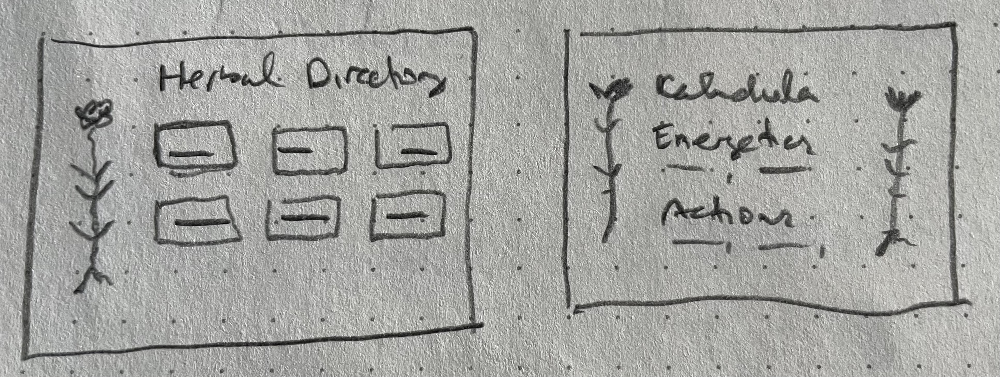

# Herbal Directory

## Project Planning

_left: on home page load; right: on detail page load_

### HTML

-   `header > h1 `
-   `main > section.info > ul #herbs-container`
    -   use empty `ul` for rendered herb cards rendered as `li`

### Events

-   on home page load:
    -   fetch all items from Supabase
    -   display all items (loop, render, append to container)
-   on detail page load:
    -   fetch single item from Supabase (by id)
    -   render to page based on item info
    -   use URLSearchParams to get item id

### Functions

-   fetch-utils:
    -   getAllHerbs, getHerb
-   render-utils:
    -   renderHerbCard, renderHerbDetail

## Workflow

### Slice 1 - HTML

-   [x] Build HTML
    -   add Supabase render script BEFORE app.js
-   [x] Get DOM elements

### Slice 2 - Get info from Supabase and display herbs on home page

-   [x] Make fetch-utils.js
    -   const URL
    -   const key
    -   create client
    -   async/await getAllHerbs()
-   [x] In app.js:
    -   addEventListener on home page for getAllHerbs()
-   [x] Create render-utils and create renderHerbCard()
-   [x] In app.js, complete addEventListener with loop, render, append to display data

### Slice 3 - Make herbs on home page clickable and display a unique detail page for each herb

-   [x] set up a folder called herb with these files:

    -   herb.js
    -   index.html

-   [x] in new index.html:

    -   paste original html into it
    -   IMPORTANT: change paths
        -   src from app.js to game.js
        -   css (ex: "../styles/reset.css")
    -   in `header`, add link to home page
    -   add a `section` with `div#herb-detail-container`

-   [x] in render-utils.js, add href to renderHerbCard

-   [x] in fetch-utils.js, create an async/await function for each detail page - getHerb(id) and return response.data

-   [x] in herb.js, begin event listener for on page load

-   [x] in render-utils.js, add renderHerbDetail(herb) and include:

    -   herbObject.name, herbObject.energetics, herbObject.actions

-   [x] in herb.js:
    -   get DOM element for herb-detail-container
    -   add on to event listener:
        -   render and append
        -   at start, add URLSearchParams and create an id variable to get id

### Slice 4 - Add CSS to home page

-   [x] Layout with flexbox and begin to style colors
-   [] Style text
-   [] Add an image to left of cards or in header

### Slice 5 - Add CSS to detail page
